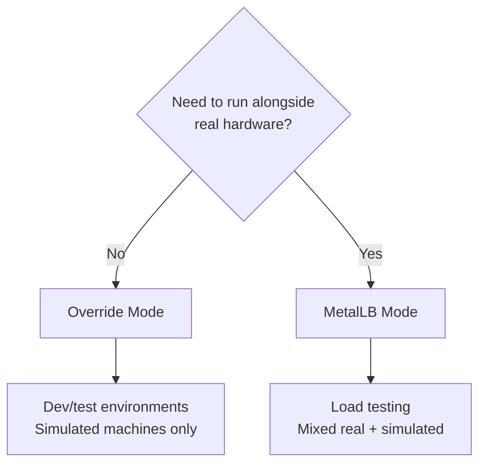
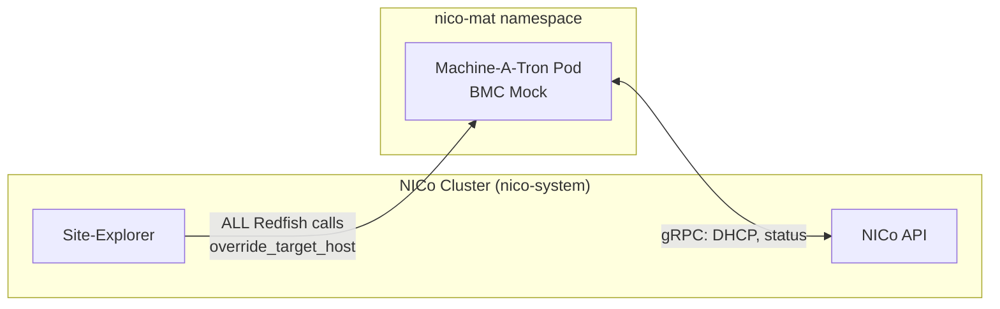
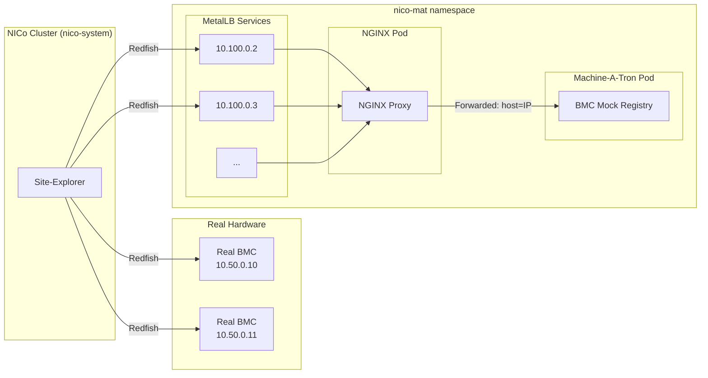

# Machine-A-Tron Helm Chart

Helm chart for deploying Machine-A-Tron - a mock machine simulator for NICo testing.

## Overview

Machine-A-Tron creates simulated bare-metal machines that behave like real hosts, allowing you to:
- Test NICo without physical hardware
- Simulate multiple hosts, DPUs, switches and power shelves
- Perform load testing at scale (up to 5000 machines)
- Run simulations alongside real hardware

## Deployment Modes

Machine-A-Tron supports **two mutually exclusive deployment modes**:

| Mode | Use Case | Real HW Compatible | Network Setup |
|------|----------|-------------------|---------------|
| **Override Mode** | Development environments | No | Simple - single endpoint |
| **MetalLB Mode** | Load testing with real HW | Yes | Complex - per-BMC IPs |

### Choosing a Mode



---

## Mode 1: Override Mode (Development)

**Use this for development environments where only simulated machines are needed.**

In this mode, NICo's Site-Explorer is configured to redirect ALL Redfish calls to
machine-a-tron via `override_target_host`. This is simple but **incompatible with
real hardware** since all BMC traffic goes to the mock.

### Architecture



### Setup

**1. Deploy Machine-A-Tron:**

```bash
helm upgrade --install nico ./helm \
  --namespace nico-mat \
  --set nico-machine-a-tron.enabled=true \
  --set nico-machine-a-tron.machines.dell-hosts.hostCount=10 \
  --set nico-machine-a-tron.machines.dell-hosts.dpuPerHostCount=2
```

**2. Configure NICo Site Config:**

```toml
# nico-api-site-config.toml
[site_explorer]
enabled = true
create_machines = true

# Redirect ALL Redfish calls to machine-a-tron
override_target_host = "nico-machine-a-tron-bmc-mock"
override_target_port = 1266
```

**3. Configure NICo Networks:**

The DHCP relay addresses in machine-a-tron must match NICo network configuration:

```toml
# OOB network for BMC management
[networks.oob-bmc]
type = "underlay"
prefix = "192.168.192.0/24"
gateway = "192.168.192.1"  # matches oobDhcpRelayAddress

# Admin network for host provisioning
[networks.admin]
type = "admin"
prefix = "192.168.176.0/24"
gateway = "192.168.176.1"  # matches adminDhcpRelayAddress
```

### Pros and Cons (Override Mode)

**Pros:**
- Simple setup - no MetalLB required
- Works in any Kubernetes cluster

**Cons:**
- Cannot use real hardware - all Redfish calls go to mock

---

## Mode 2: MetalLB Mode (Large-Scale Testing)

**Use this for dev or load testing environments where simulated machines run alongside real hardware.**

In this mode, each simulated BMC gets a dedicated external IP via MetalLB. NICo
Site-Explorer connects directly to these IPs, allowing simulated and real machines
to coexist on the same NICo instance.

### Architecture (MetalLB Mode)



### Prerequisites (MetalLB Mode)

- MetalLB installed and configured
- BGP mode required for scale 2000+ services
- Dedicated IP range for simulated BMCs (separate from real hardware)

### Setup (MetalLB Mode)

**1. Deploy with MetalLB BMC Proxy enabled:**

```bash
helm upgrade --install nico ./helm \
  --namespace nico-mat \
  --set nico-machine-a-tron.enabled=true \
  --set nico-machine-a-tron.nginxBmcProxy.enabled=true \
  --set nico-machine-a-tron.nginxBmcProxy.ipRange="10.100.0.0-10.100.7.254" \
  --set nico-machine-a-tron.nginxBmcProxy.bgp.enabled=true \
  --set nico-machine-a-tron.machines.dell-hosts.hostCount=100 \
  --set nico-machine-a-tron.machines.dell-hosts.dpuPerHostCount=2 \
  --set nico-machine-a-tron.machines.dell-hosts.oobDhcpRelayAddress="10.100.0.1"
```

**2. NICo Site Config - NO override_target:**

```toml
# nico-api-site-config.toml
[site_explorer]
enabled = true
create_machines = true

# DO NOT set override_target_host - let NICo connect to actual BMC IPs
# override_target_host = ...  # NOT SET!
# override_target_port = ...  # NOT SET!
```

**3. Configure Separate Networks:**

```toml
# Real hardware OOB network
[networks.real-oob]
type = "underlay"
prefix = "10.50.0.0/24"
gateway = "10.50.0.1"

# Simulated BMC network (MetalLB range)
[networks.simulated-oob]
type = "underlay"
prefix = "10.100.0.0/21"
gateway = "10.100.0.1"  # matches oobDhcpRelayAddress for simulated machines
```

### IP Allocation - How It Works

NICo allocates IPs **sequentially** via gRPC API:
- First machine gets `.2` (after gateway `.1`)
- Second machine gets `.3`
- And so on...

This means MetalLB services with sequential IPs will match NICo allocations
**as long as the subnet is dedicated to machine-a-tron**.

### Scale Limits

| Scale | Subnet | Max BMCs | BGP Required |
|-------|--------|----------|--------------|
| Small | /21 | 2048 | No (L2 OK for testing) |
| Medium | /20 | 4096 | Recommended |
| Large | /19 | 8192 | Yes |
| Max | /18 | 16384 | Yes |

The chart enforces a **hard limit of 16384 BMCs** (/18 subnet) to protect cluster stability.

If you exceed the limit, the chart **fails**:
```
SCALE LIMIT EXCEEDED: 16500 BMCs requested, maximum is 16384 (/18 subnet).
```

### BGP Configuration (Required for Large Scale)

For deployments with 2000+ services, BGP mode with route aggregation is **required**:

```yaml
nginxBmcProxy:
  enabled: true
  ipRange: "10.100.0.2-10.100.15.254"  # /20 range

  ipPool:
    create: true
    l2Advertisement: false  # Disable L2 for BGP

  bgp:
    enabled: true
    aggregationLength: 20  # Announce single /20 instead of 4000+ /32s
```

**Why BGP?** Without `aggregationLength`, MetalLB advertises each service IP as an
individual /32 route. With thousands of services, this overwhelms upstream router control planes.

### Pros and Cons (MetalLB Mode)

**Pros:**
- Compatible with real hardware
- Enables realistic load testing

**Cons:**
- Requires MetalLB with BGP for large scale
- More complex network setup
- Requires dedicated IP range

---

## Configuration Reference

### Key Parameters

| Parameter | Description | Default |
|-----------|-------------|---------|
| `machineATron.nicoApiUrl` | NICo API server URL | `https://nico-api.nico-system.svc.cluster.local:1079` |
| `machineATron.cleanupOnQuit` | Delete machines from API on shutdown | `false` |
| `machines.<name>.hostCount` | Number of hosts to simulate | `10` |
| `machines.<name>.dpuPerHostCount` | DPUs per host | `2` |
| `machines.<name>.hwType` | Hardware type | `dell_poweredge_r750` |
| `machines.<name>.oobDhcpRelayAddress` | BMC network gateway | `10.100.0.1` |
| `machines.<name>.adminDhcpRelayAddress` | Admin network gateway | `10.101.0.1` |
| `nginxBmcProxy.enabled` | Enable MetalLB mode | `false` |
| `nginxBmcProxy.ipRange` | MetalLB IP pool range | `""` |
| `nginxBmcProxy.bgp.enabled` | Enable BGP advertisement | `false` |
| `terminationGracePeriodSeconds` | Shutdown timeout | `60` |

### Machine Groups

Configure multiple machine groups with different hardware types:

```yaml
machines:
  gb300-hosts:
    hwType: supermicro_gb300_nvl
    hostCount: 100
    dpuPerHostCount: 2
    oobDhcpRelayAddress: "10.100.0.1"
    adminDhcpRelayAddress: "10.101.0.1"

  switches:
    hwType: nvidia_switch_nd5200_ld
    hostCount: 10
    dpuPerHostCount: 0
    oobDhcpRelayAddress: "10.100.0.1"
    adminDhcpRelayAddress: "10.101.0.1"

  power-shelves:
    hwType: liteon_power_shelf
    hostCount: 5
    dpuPerHostCount: 0
    oobDhcpRelayAddress: "10.100.0.1"
    adminDhcpRelayAddress: "10.101.0.1"
```

### Supported Hardware Types

From `HostHardwareType` enum in `crates/bmc-mock/src/lib.rs`:

- `dell_poweredge_r750` (default)
- `supermicro_gb300_nvl`
- `nvidia_dgx_gb300`
- `nvidia_dgx_h100`
- `wiwynn_gb200_nvl`
- `lenovo_gb300_nvl`
- `liteon_power_shelf`
- `nvidia_switch_nd5200_ld`
- `generic_ami`
- `generic_supermicro`

### Service Count Calculation

The chart auto-calculates LoadBalancer services (MetalLB mode) from machine config:

```
totalBMCs = Σ(hostCount + hostCount × dpuPerHostCount) for all groups
```

| Config | Calculation | Services |
|--------|-------------|----------|
| 10 hosts, 2 DPUs | 10 + 20 | 30 |
| 100 hosts, 2 DPUs | 100 + 200 | 300 |
| 4500 hosts, 2 DPUs | 4500 + 9000 | 13500 |

---

## Additional Features

### Graceful Shutdown

```yaml
terminationGracePeriodSeconds: 60  # Seconds to wait before SIGKILL

machineATron:
  cleanupOnQuit: true  # Delete machines from NICo API
```

### Persistence

Preserve machine state across restarts:

```yaml
persistence:
  enabled: true
  storageClass: "standard"
  size: 1Gi
```

### Monitoring

Enable Prometheus metrics:

```yaml
serviceMonitor:
  enabled: true
  interval: 30s
```

---

## Troubleshooting

### Pod CrashLoopBackOff

Check logs:
```bash
kubectl -n nico-mat logs deployment/nico-machine-a-tron
```

Common causes:
- NICo API unreachable - check `machineATron.nicoApiUrl`
- Certificate issues - check cert-manager
- Missing network config in NICo

### MetalLB Services Not Getting IPs

```bash
# Check MetalLB speaker logs
kubectl -n metallb-system logs -l app=metallb,component=speaker

# Verify IPAddressPool exists
kubectl -n metallb-system get ipaddresspools

# Check BGPAdvertisement
kubectl -n metallb-system get bgpadvertisements
```

### Scale Limit Error

If you see:
```
SCALE LIMIT EXCEEDED: 16500 BMCs requested, maximum is 16384 (/18 subnet).
```

**Solution:** Reduce `hostCount` or `dpuPerHostCount` to stay within the /18 limit (16384 BMCs max).
